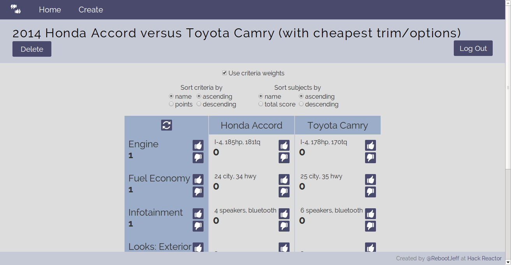

# Co-Compare
Crowd-sourced decision matrices. Check out the deployed goodness: [Co-Compare is here!](http://cocompare.herokuapp.com)

## Contents

This README is intended to inform users, help beginner/intermediate devs, and brag to anyone looking to hire me ;)

- [Usage](#usage)
  - [Screenshots](#screenshots)
- [Development](#development)
  - [Tech Stack](#tech-stack)
  - [Tools](#tools)
  - [The Repo](#the-repo)
  - [The Creator](#the-creator)

## Usage

1. Log in via Facebook. Co-Compare will only store your name/ID and *nothing else* (check source code if you don't believe me).
2. Create a comparison table by providing subjects (columns) to compare and criteria (rows) to compare them against.
  - Optional: provide details (cells) to help inform others who view the comparison table.
3. Copy/paste/share the link generated for your comparison table.
4. You and the rest of the world can upvote/downvote the various aspects of each subject *and* the criteria.
5. You and the rest of the world can make decisions based on the results of votes from you and - as you may have guessed - *the rest of the world*.

### Screenshots

#### Home Page

#### Example comparison

#### Example comparison creation

## Development

The biggest challenges were learning Sequelize and successfully playing whack-a-mole with deployment issues.

### Tech Stack
- **AngularJS**: client-side framework
- **Node.js**: server-side app platform
  - **Express**: server-side framework
  - **Passport**: server-side authentication (via Facebook)
  - **Sequelize**: ORM (powerful, but docs could use a buff)
- **SQL**: database (MySQL for dev; PostgreSQL for production)
- **Moment.js**: time/date prettifier
- **Stylus**: CSS pre-processor

(Why do some JS libraries/frameworks end with ".js" while others end with "JS" while others end with no suffix at all?)

### Tools
- **git** (duh): version control boss
- **npm** (duh): package wrangler for back-end libraries
- **Bower**: package wrangler for front-end libraries
- **Yeoman**: scaffolding/boilerplate provider
- **Grunt**: workflow-related task runner
- **Heroku**: git-friendly web app hosting provider
- **Ubuntu**: UNIX for those of us who're too cheap for MacOS
- **Sublime Text 2**: editor with support for linter and omnipotent syntax highlighting

### The Repo

- **dev**: media files related to design
- **models**: database setup
- **public**: front-end
  - **images**: icons
  - **scripts**: client app + Angular controllers
  - **styles**: Stylus code and resultant CSS
  - **views**: HTML inserted into `index.html` by Angular
- **routes**: controllers that interact with the database
- `config_production.js`: references to production environment variables
- `config_dev.js`: (not provided) private, local counterpart to config_production.js
- `server.js`: starts the server

### The Creator

Co-Compare was created by [RebootJeff](http://rebootjeff.github.io) in 3 weeks at [Hack Reactor](http://www.hackreactor.com).
