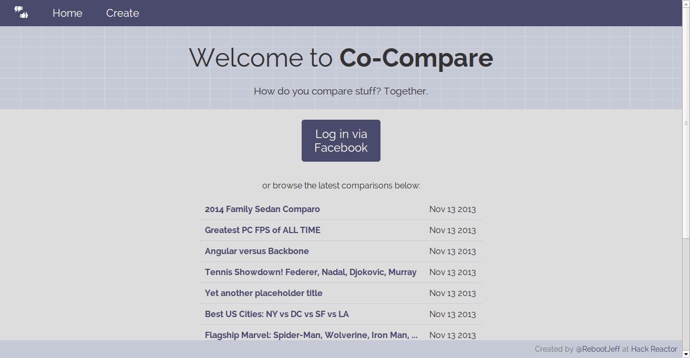
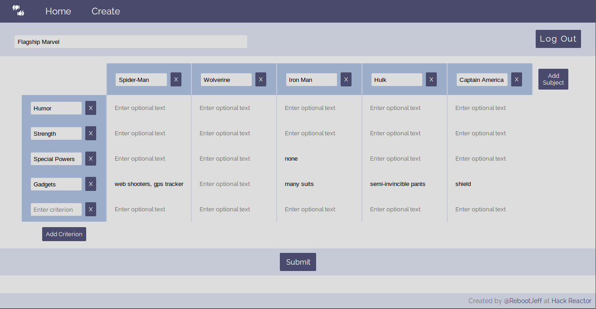

# Co-Compare
Crowd-sourced decision matrices.

Check out the deployed goodness: [LINK TO DEPLOYED VERSION GOES HERE YEAH I'M YELLING CAN'T YOU SEE](http://)

## Contents

- [Usage](#usage)
- [Screenshots](#screenshots)
- [Development](#development)
  - [Tech Stack](#tech-stack)
  - [Tools](#tools)
  - [Challenges](#challenges)
  - [The Code](#the-code)
  - [The Creator](#the-creator)

## Usage

1. Log in via Facebook. Co-Compare will only store your name/ID and *nothing else* (check source code if you don't believe me).
2. Create a comparison table by providing subjects (columns) to compare and criteria (rows) to compare them against.
  - Optional: provide details (cells) to help inform others who view the comparison table.
3. Copy/paste/share the link generated for your comparison table.
4. You and the rest of the world can upvote/downvote the various aspects of each subject *and* the criteria.
5. You and the rest of the world can make decisions based on the results of votes from you and - as you may have guessed - *the rest of the world*.

### Screenshots

#### Home Page

#### Example comparison #1

#### Example comparison #2

#### Example comparison creation

## Development

Creating this app helped me learn valuable lessons about full-stack architecture, CRUD, workflow tools, UX/UI, version control, Linux, documentation, and deployment. I expected some of these topics to be easy, but the learning process was far from hiccup-free. Never give up!

### Tech Stack
- **AngularJS**: client-side framework
- **Node.js**: server-side app platform
  - **Express**: server-side framework
  - **Passport**: server-side authentication (via Facebook)
  - **Sequelize**: ORM
- **MySQL**: database
- **Moment.js**: time/date prettifier

(Why do some JS libraries/frameworks end with ".js" while others end with "JS" while other end with no suffix at all?)

### Tools
- **git** (duh): version control tool
- **npm** (duh): package manager for back-end libraries
- **Bower**: package manager for front-end libraries
- **Yeoman**: scaffolding/boilerplate provider
- **Grunt**: workflow-related task automation
- **Stylus**: CSS pre-processor
- **AWS**: web app hosting provider
- **Ubuntu**: UNIX for those of us who can't afford MacOS
- **Sublime Text 2**: linter and omnipotent syntax highlighting

### Challenges

- Working with an asynchronous platform like Node.js is great for performance, but it can feel less straightforward for development.
- Relational databases are tricky --especially when querying them in an asynchronous environment.
- Authentication can be quirky, and introducing authentication to an app requires the addition of code into all parts of the app. With each addition comes its own set of questions (e.g., Should the view be affected? What access should be limited?).

### The Code

- **public**: front-end code
  - **views**: HTML used by Angular
  - **scripts**: client app + Angular controller modules
  - **styles**: Stylus code and resultant CSS
  - (images: just some icons)
  - (bower_components: not in GitHub repo)
- **server**: back-end code
  - **models**: database setup using Sequelize
  - **routes**: controllers that interact with the database

### The Creator

Co-Compare was created by [RebootJeff](http://rebootjeff.github.io) in 3 weeks at [Hack Reactor](http://www.hackreactor.com).
